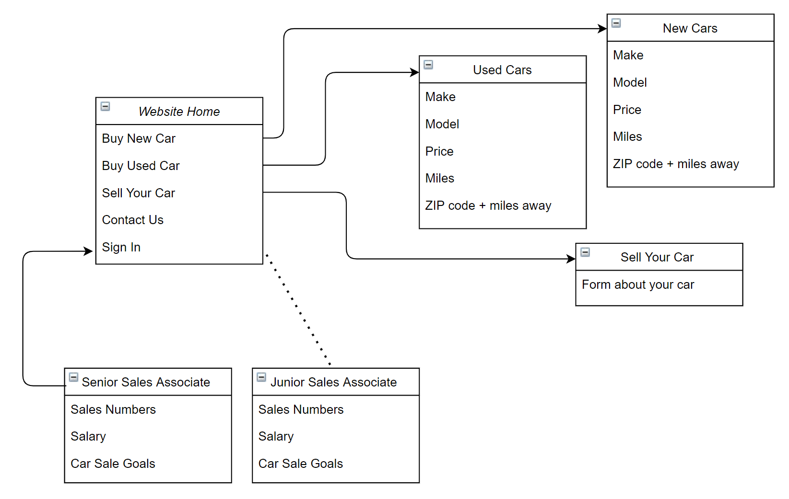

# Car-Dealership
A site, that when logged in, users can `create`, `get`, `update` and `delete`. 

### App Screenshot --- Pending 
 

### Technologies used 
* Postman --- To check the backend of the app, CRUD or makes and models 
* pgAdmin --- Checking the database to see the connection between app and database 
* Heroku --- Deploying the backend of the app 
* Angular --- Creating the frontend of the app 

### User Stories
* Users are people interested in buying or celling cars. 
  They would be able to post their own car as well as view others cars 

1. As a user, I want to be able to log in.
2. As a logged-in user, I want to be able to get all the makes of vehicles.
3. As a logged-in user, I want to be able to get all the models of vehicles.
4. As a logged-in user, I want to be able to get single makers of vehicles.
5. As a logged-in user, I want to be able to get single models of vehicles.
6. As a logged-in user, I want to be able to create single vehicle make.
7. As a logged-in user, I want to be able to create single vehicle model.
8. As a logged-in user, I want to be able to update single vehicle make.
9. As a logged-in user, I want to be able to update single vehicle model.
10. As a logged-in user, I want to be able to delete single vehicle make.
11. As a logged-in user, I want to be able to delete single vehicle model.
12. As a logged-in user, I want to be able to logout to secure my information.

### Wireframe / ERD 
version 2.0

version 1.0

#### Unsolved Issues  
1. 

#### Project Talking Points:
* What would you do differently?
* What are you most proud of?
* What would you do next?
* How did you plan your project?
* What did you learn?
